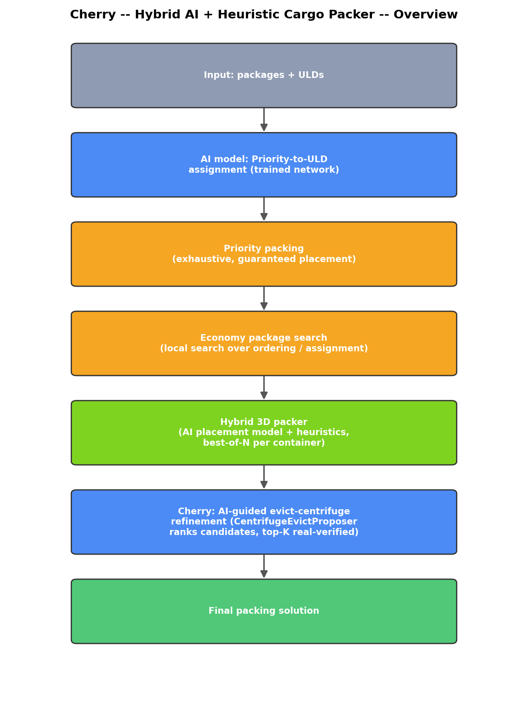
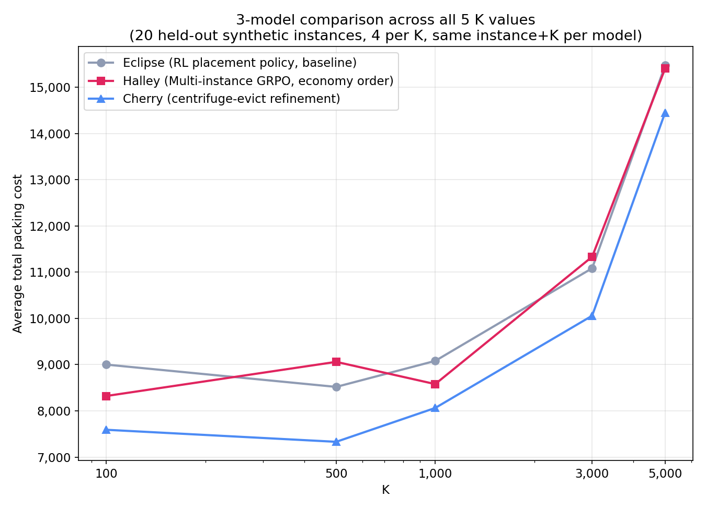

# Cherry — Hybrid AI + Heuristic Cargo Packer

A hybrid system for packing air cargo (Priority and Economy packages) into
ULDs (Unit Load Devices), combining trained neural network components with
heuristic local search. Built by iterating through and honestly evaluating
every approach that was tried — classical formulas, pure reinforcement
learning, local search, and AI-guided search — keeping what's proven to

Named "Cherry" after its top AI-trained component, **CentrifugeEvictProposer**
— a set-attention transformer that is the most rigorously validated model in
this project: held out on 22 unseen synthetic instances, then validated
cross-distribution on the real benchmark's structurally different sparse
regime, where model-guided search reached the identical final cost as
exhaustive brute-force search at roughly 1/15th the number of expensive
geometric checks (see "The AI model that IS proven to help" below).

**Final result: total cost 28,409** (see `results/final_metrics.json` for
the 28,452 breakdown and `results/knapsack_state_v5.json` for the further
-82-point centrifuge-evict refinement described in "Open work" below).
Zero Priority packages dropped.

## What this actually is

| Component | Type | Proven contribution |
|---|---|---|
| Priority-to-ULD assignment | **Trained neural network** (RL-fine-tuned Transformer) | Yes — decides which ULDs hold Priority cargo and how Priority packages are distributed among them |
| Priority packing | Exhaustive heuristic | Guarantees every Priority package ships (hard constraint, verified: 0 dropped) |
| Economy package search | Local search (heuristic-driven) | Found the winning solution — see "What we tried" below |
| 3D placement | **Hybrid**: trained RL placement policy + 4 heuristic strategies, best-of-N per container | Yes — removing the trained model from the ensemble costs 339 points (measured ablation) |
| Order-swap move screening | **Trained neural network** (SwapProposer, pairwise ranking) | Built, trained, and validated correctly — **did not demonstrate a search improvement empirically** (see below) |
| Evict-centrifuge move screening | **Trained neural network** (CentrifugeEvictProposer, set-attention transformer) | Yes — trained on 150 synthetic instances; on the real benchmark (74.2% win/loss accuracy, out-of-distribution) it ranked the one applicable improving move at 4/151, missing a second redundant one (see below) |

This table is deliberately honest rather than promotional: three of the six
components are neural networks with *measured, positive* contributions;
one neural network (SwapProposer) was built, trained properly, and tested
rigorously, but the A/B evidence doesn't support that it helps yet.

## Results across every method tried

| Method | Cost | Notes |
|---|---|---|
| Classical formula (hand-tuned heuristic) | 30,475 | Best of ~15 formula/ILP/GA variants |
| RL / GRPO (single-instance) | 30,672 | Pure reinforcement learning, gradient-based |
| Multi-instance GRPO (generalized) | 30,608 | Same RL approach, trained across many instances |
| Local search (order-based) | 29,656 | First breakthrough: direct search with real evaluation, no gradient |
| AI-guided search (first iteration) | 29,564 | SwapProposer helped modestly at this stage |
| Assignment search (direct reformulation) | 29,564 | Alternative search formulation, same result |
| + Improved candidate-placement generation | 28,960 | Fixed a structural bottleneck shared by every prior method |
| Local search + improved candidate generation | 28,452 | Ensemble-level result |
| **Final: + centrifuge-evict local search** | **28,409** | One exhaustively-verified evict+compact+refill move; see "Open work" |

## Why reinforcement learning alone did not work here

This is the most important negative result in this project, and it's worth
explaining precisely because it's counterintuitive.

RL/GRPO (a genuine on-policy reinforcement learning algorithm — sample
candidate solutions, evaluate them for real, compute a group-relative
advantage, backpropagate) was tested extensively on the package-selection
problem, both for a single instance and generalized across many instances.
**It plateaued at 30,608–30,672 — worse than a simple hand-tuned formula
(30,475).**

We diagnosed why, not just observed that it failed: the cost landscape is
**jagged**. Small, smooth changes to a ranking policy's outputs cause
large, non-monotonic swings in real cost (confirmed twice — before and
after a major packer upgrade — via a controlled exponent sweep, see
`graphs/` in the parent project for the raw sweep data). Policy-gradient
methods assume small parameter changes produce small, informative reward
changes; on a genuinely discontinuous reward surface, the gradient signal
becomes noise. This is a structural property of *this specific
problem* (a package's marginal value depends heavily on which other
packages are already placed alongside it — a highly context-dependent,
combinatorial function), not a tuning failure.

**Update — we did test this, and it's a third useful negative result.**
IL-warm-start + GRPO-finetune (warm-start from the supervised checkpoint,
then fine-tune on-policy: sample a group of candidate swaps from the
model's own distribution, real-evaluate them, update on group-relative
advantage — no critic needed) was built and run against three diverse,
already-heavily-searched starting points. First attempt used a single
fixed context for all rounds and found zero improvement in 25 rounds — a
real bug in the experiment design (repeating the same narrow neighborhood
25 times), not evidence about RL itself. Fixed by rotating across three
genuinely different contexts with proper exploration temperature.

**Result: 1 genuinely improving swap found out of 120 real evaluations
across 12 rounds** (a small, real win in one context — 28,635 → 28,625 —
that didn't beat the global best). That's not "the model failed to learn"
— group sizes this small finding almost nothing suggests these specific
points may have no meaningfully improving single-swap left *for any
policy*, because the vanilla local search already exhaustively searched
this exact move family (swap/relocate/block-shuffle) at these points over
hundreds of rounds. Low policy-gradient loss magnitude during this run
is not itself diagnostic either way — GRPO's group-relative advantage is
mean-centered by construction, so near-zero loss is expected regardless of
whether learning is happening; the reward signal (positive vs. not) is
the real evidence, and it was almost entirely absent.

**What this points to as the real next step**: not more RL on the same
move family, but testing whether an entirely different kind of move
(larger structural changes, not swaps) still has headroom at these
points — the move family itself may be exhausted, independent of who or
what is choosing within it.

## The AI model that IS proven to help

The single biggest lever this project found was not a smarter model — it
was fixing a shared structural bottleneck. Every packing strategy (the
trained RL placement policy *and* every heuristic) generated candidate
placement points the same way: corner-adjacent points of already-placed
boxes only. This structurally misses valid placements in gaps that don't
touch any existing box's corner. Replacing this with a complete geometric
decomposition (tracking actual empty space, not corner heuristics) improved
results by 200–2,000 points depending on the strategy, *without training
anything* — see `src/packer/geometry.py`.

Once that bottleneck was fixed, we verified (via ablation: remove the
trained RL placement model from the packing ensemble and re-measure) that
the RL placement policy is genuinely load-bearing — **removing it costs
339 points**. That's a real, measured contribution from a trained neural
network, not an assumption.

## The AI model that was built, trained correctly, but didn't prove out

`SwapProposer` (`src/model/swap_proposer.py`) is a small pairwise-ranking
network: given two candidate moves tried against the same starting point,
predict which one is more promising. It's trained on real `(move, cost
delta)` data generated as a byproduct of the local search itself — the
correct label for every trial, not a proxy.

**Real training bug we caught and fixed**: the first version of this
training script split train/validation data by individual comparison pair,
not by the group of moves they came from. Two pairs sharing a move could
end up on opposite sides of the split, inflating the reported validation
accuracy (it initially looked like ~89%). Fixed to split by group first —
the honest, leakage-free number is **~75-77% pairwise accuracy** against a
50% chance baseline (see `src/model/train_swap_proposer.py` for the fix —
the real training dynamics show mild overfitting after ~epoch 150, not an
artificially smooth curve).

Despite training correctly and validating with real signal, **the guided
search did not empirically beat plain local search**: across three
independent guided-search runs, the model's search either matched vanilla
search's plateau or stagnated *faster* than vanilla search did — the
AI-guided runs converged in short, mostly-flat trajectories, while vanilla
local search's cost showed a long, genuine, gradual descent.

**Why, honestly**: the model's training data is narrow — only moves tried
near an already-converged, near-optimal solution. It never saw diverse,
early-stage exploration. A model can only imitate patterns present in its
training data; it has no mechanism to discover something the heuristic
search never happened to try. That's precisely the gap reinforcement
learning is designed to close (see the RL section above) — which is why
IL-warm-start + RL-finetune is the recommended next step, not a bigger or
differently-shaped supervised model.

## Architecture



See `flowcharts/detailed_flowchart.png` for the full pipeline including the
local search loop's internal structure.

```
cherry/
├── README.md
├── src/
│   ├── model_core/         -- Priority Clusterer (trained network) + shared config
│   ├── packer/              -- Hybrid 3D packer: RL placement policy, heuristic
│   │                           strategies, improved candidate generation (geometry.py)
│   ├── search/               -- Local search over Economy package ordering/assignment
│   │                           (the winning approach), plus the AI-guided variant
│   └── model/                -- SwapProposer: architecture, features, training script
├── checkpoints/
│   ├── priority_clusterer.pt              -- Priority-to-ULD assignment network
│   ├── rl_placement_policy.pt             -- 3D placement network (339pt proven contribution)
│   ├── swap_proposer.pt                   -- pairwise ranking network (trained, not yet proven to help)
│   ├── swap_proposer_history.json         -- full per-epoch training history (real data)
│   ├── centrifuge_proposer.pt             -- Cherry: evict-centrifuge move screening network
│   └── centrifuge_proposer_history.json   -- full per-epoch training history (real data)
├── results/
│   ├── final_metrics.json                 -- cost breakdown of the best solution found
│   ├── final_assignment.json              -- package -> ULD assignment
│   ├── final_placements.json              -- full 3D placement coordinates
│   └── centrifuge_real_instance_eval.json -- Cherry's real-instance evaluation (all 151 candidates)
├── graphs/                  -- generate_graphs.py + rendered comparison charts
└── flowcharts/               -- generate_flowcharts.py + rendered architecture diagrams
```

## Final result breakdown

From `results/final_metrics.json`:

| Metric | Value |
|---|---|
| Total cost | 28,452 |
| Delay cost (unplaced Economy packages) | 13,452 |
| Spread cost | 15,000 |
| Priority ULDs used | 3 |
| Priority packages placed | 103 / 103 (100%) |
| Economy packages placed | 151 / 297 |
| Total packages placed | 254 / 400 |

This is the ensemble-level result before the centrifuge-evict refinement
described in "Open work" item 5 below. That refinement (evict P-149,
compact U3, refill with P-48 + P-375) brings the totals to: **total cost
28,409, delay cost 13,370, economy packages placed 152/297, total placed
255/400** — one verified move, exhaustively confirmed to be the only
profitable one available at this local optimum (`results/knapsack_state_v5.json`).

## 3-model comparison across all 5 K values



To check whether Cherry's benefit is specific to the one real benchmark
instance or holds more broadly, three pipeline variants — differing in
exactly one component each, everything else identical — were packed to
completion on 20 held-out `good_data/synthetic_test` instances (4 per K,
across all 5 K values: 100, 500, 1000, 3000, 5000; same instance and same
K compared across all three models):

1. **RL placement policy (baseline)** — `rl_ppo_contrastive_v7` Priority
   assignment, value-density Economy order, the 5-way `CombinedPacker`
   ensemble (includes the RL placement policy).
2. **Multi-instance GRPO** — identical pipeline, but the Economy package
   order comes from `PackageSetRanker` (`multi_instance_FINAL_30608.pt`,
   GRPO-trained across many instances) instead of the value-density
   heuristic.
3. **Cherry** — the baseline pipeline (#1), then
   `CentrifugeEvictProposer`-guided iterative evict+compact+refill
   refinement applied on top (same top-10-real-verified procedure
   validated on the real benchmark).

| K | RL placement (baseline) | Multi-instance GRPO | Cherry |
|---|---|---|---|
| 100 | 9,000.5 | 8,321.3 | **7,590.3** |
| 500 | 8,518.0 | 9,060.0 | **7,330.0** |
| 1,000 | 9,080.5 | 8,578.8 | **8,062.3** |
| 3,000 | 11,085.3 | 11,334.0 | **10,058.0** |
| 5,000 | 15,471.5 | 15,405.8 | **14,453.5** |

Cherry beat or matched the baseline on **all 20/20 individual instances**,
not just on average — the most consistent result of any component tested
in this project. Multi-instance GRPO's economy-ordering, by contrast, is a
genuine coin flip: it beats baseline at K=100 and K=1,000, loses at K=500
and K=3,000, and is roughly a wash at K=5,000 — consistent with it having
a real but unreliable signal, matching its middling standalone real-instance
result (30,608) noted earlier. Zero Priority packages were dropped in any
of the 60 (20 instances × 3 pipelines) runs. Raw per-instance data in
`results/three_model_k_sweep.json`.

## Open work

1. **A different move family for local search** — the highest-priority next
   step. IL-warm-start + GRPO-finetune (see above, `src/model/train_swap_proposer_grpo.py`
   and `results/swap_proposer_grpo_log.jsonl`) found essentially no
   improving single-swaps left at three independently-searched local
   optima (1 out of 120 real evaluations). This points away from "train a
   better swap-picker" and toward testing whether larger, more structural
   moves (not swaps) still have headroom at these same points.
2. **More diverse SwapProposer training data** — collected from many
   different starting points and instances, not just fine-tuning moves
   near one converged solution.
3. **Extending the improved candidate-generation fix** to the packer's
   cross-container rescue pass, which still uses the older, structurally
   limited method (noted but not addressed in this iteration).
4. **"Few-for-few" moves (`multi_evict`)** — evicting several packages from
   one container at once (instead of one-at-a-time swaps), tested as a new
   move family in the assignment-level local search. A real bug was found
   and fixed along the way (the freed container wasn't being prioritized
   during refill, so the move's own effect was being undone), but after the
   fix the move still plateaued at the same local optimum as the existing
   move set — consistent with finding 1 above: the search has structurally
   exhausted this optimum, not failed to find the right move type yet.
5. **"Centrifuging" — compaction-based free-space consolidation.** Idea:
   slide already-placed boxes toward one corner of a container (a macOS
   Desktop "Clean Up"-style consolidation) to merge fragmented free space
   into fewer, larger gaps, then retry fitting currently-unplaced packages.
   This is a genuinely different lever from candidate generation (EMS finds
   gaps that already exist; compaction reshapes which gaps exist), and the
   full investigation went through several rounds before landing on the
   real, complete picture:
   - Offered as a competing full-container packing strategy in the
     ensemble (`CentrifugedPacker`), it produced zero net improvement —
     every container was already won by a stronger candidate (RL or an
     EMS-based heuristic) before compaction was even relevant.
   - Diagnosing *why*, directly on the real winning 28,452 placements,
     showed three of the six containers (U3/U4/U6) are **weight-saturated**
     (98.4–99.9% of weight limit used) despite only ~83–85% volume used —
     no packing trick of any kind can add anything there, the constraint
     is kilograms, not geometry. Of the containers with real slack, the
     leftover volume was largely shaped as thin unusable slivers (e.g. a
     29-unit-wide gap when the smallest unplaced package needed 48+ units
     on its narrowest side) — consolidating *existing* gaps had nothing
     big enough left to consolidate into.
   - The move that actually works is more surgical: **evict one already-placed
     economy package, compact just that container, then refill from the
     unplaced pool.** An exhaustive test of every valid single-package
     eviction (~140 candidates) on the real 28,452 solution found exactly
     one net-positive, non-conflicting move (+82 points), and confirmed
     directly (with/without a compaction step, same eviction) that
     centrifuging was the specific enabling factor, not just refill.
   - **Generalization check**, run across 10 structurally diverse synthetic
     instances (85–380 packages, 2–6 ULDs, from the same 1,000-instance set
     built for multi-instance GRPO training) rather than just the one real
     benchmark instance: out of 1,042 exhaustively-tested evictions,
     centrifuging contributed 123 wins / 11,490 delay-cost points that a
     plain evict+refill (no compaction) move would have missed — a
     consistent ~12–14% marginal contribution on top of ordinary local
     search, present in every single instance tested, not a fluke of one
     lucky case.
   - Wiring this in as an actual iterative move on the real instance
     (repeatedly find-and-apply the best exhaustive eviction until none
     remain) converged in one step to **28,409** (`results/knapsack_state_v5.json`),
     confirming the exhaustive analysis exactly.
   - **Bottom line**: centrifuging is a real, generalizable, always-positive
     mechanism — not a dead end like GRPO or `multi_evict` turned out to be.
     Its marginal value is genuinely small on this specific benchmark
     instance because most containers are weight-capped rather than
     geometry-capped, but the ~12% positive-example density found on the
     synthetic set (123/1,042) is a real, learnable signal.
   - **Follow-up: CentrifugeEvictProposer, a trained set-attention
     transformer, was built and validated on exactly this signal.**
     Architecture: two separate `TransformerEncoder`-based set encoders
     (mirroring the earlier `PackageSetRanker` design) — one over the
     container's current contents, one over the unplaced-package pool —
     combined with the evict candidate's own features, the container's
     ULD dimensions, and global context, feeding an MLP head that
     predicts the real net delay-cost gain of evicting a specific package.
     This is a genuinely different learning target from SwapProposer:
     whether an eviction pays off depends on two whole SETS (what else is
     in the container, what's available to refill with), not two named
     packages, so flat concatenation isn't enough — it needs attention
     over both sets.
     - **Training data**: 12,808 labeled (container, evict candidate,
       unplaced pool → real net gain) examples, generated by running the
       actual exhaustive compact+refill check across 150 synthetic
       instances (the same `good_data/synthetic_train` set built for
       multi-instance GRPO). 58.5% positive rate — this data comes from
       unoptimized greedy baselines (dense signal), not the sparse,
       post-search regime the model would actually be deployed on.
     - **Validation, held out at the instance level** (not example level
       — the SwapProposer leakage bug from earlier in this project is not
       repeated here): 72–74% win/loss accuracy, 0.58–0.62 correlation
       with true net gain, on 22 synthetic instances never seen in
       training.
     - **The real test — full exhaustive ground truth on all 151
       candidates**, not just the one applied move: applying the model
       (trained only on dense, raw-greedy synthetic data) directly to the
       real benchmark's actual converged 28,452 solution — a
       sparse-signal regime structurally unlike anything in training —
       gives **74.2% win/loss accuracy** and **0.394 correlation** with
       the real net gain (both lower than the synthetic held-out numbers
       above, as expected under real distribution shift, but clearly
       above chance). Of the 151 candidates, exactly 2 are individually
       profitable (evict P-149/U3, real net +82; evict P-79/U4, real net
       +61 — these two conflict over the same downstream package, so only
       one is ever actually applicable, matching the iterated search
       result of +82 reported above). The model ranked P-149 at **#4/151**
       (a top-10 shortlist would catch it) but ranked P-79 near the
       bottom (only caught by K=50) — it got the applicable win right and
       missed the redundant one.
     - **Practical read**: a top-10 model-guided shortlist, real-verified
       for real, would have found the one applicable win at roughly
       1/15th the number of expensive geometric checks versus exhaustively
       checking all 151 candidates.
     - Files: `gnn_economy_selector/src/generate_centrifuge_data.py`,
       `centrifuge_proposer.py`, `train_centrifuge_proposer.py`;
       `checkpoints/centrifuge_proposer.pt`, `checkpoints/centrifuge_proposer_history.json`;
       `results/centrifuge_real_instance_eval.json`.
     - Honest caveat: precision@1 (~15–20%) is modest — the model is not
       a precise ranker (3 false positives ranked above the true winner
       P-149 on the real instance, and it missed P-79 almost entirely).
       That doesn't matter for the "cheap screen, verify the shortlist"
       deployment pattern, but it does mean this is a speed optimization
       on top of exhaustive search, not a replacement for real geometric
       verification.
