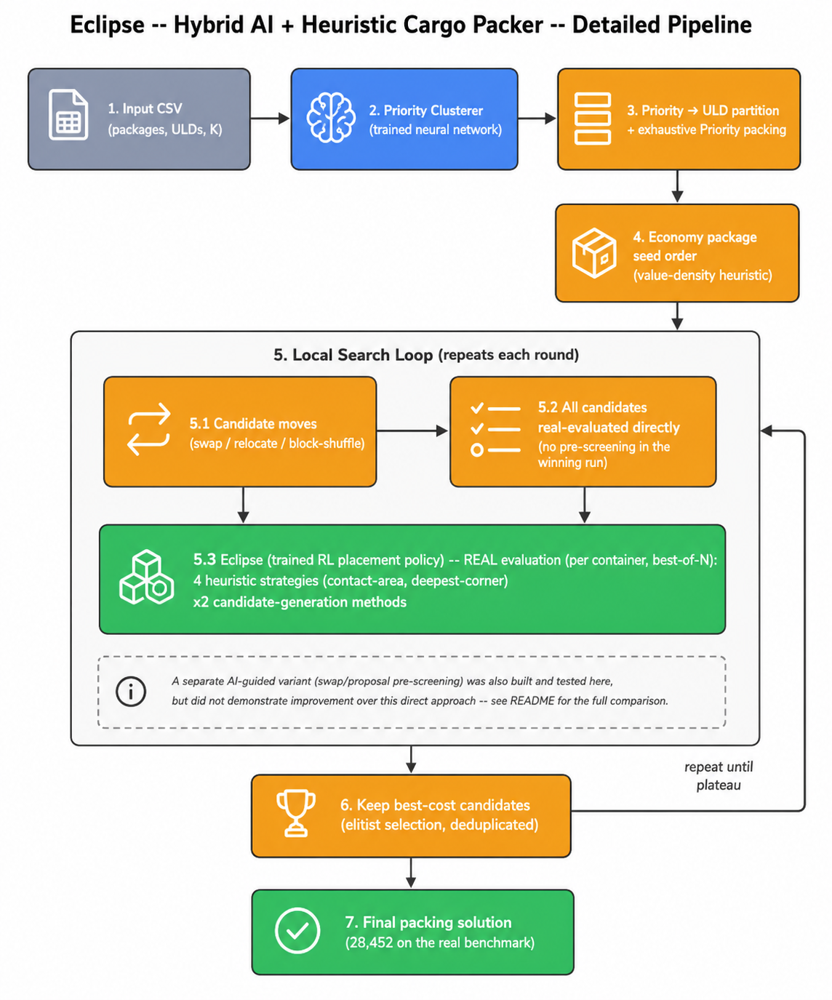
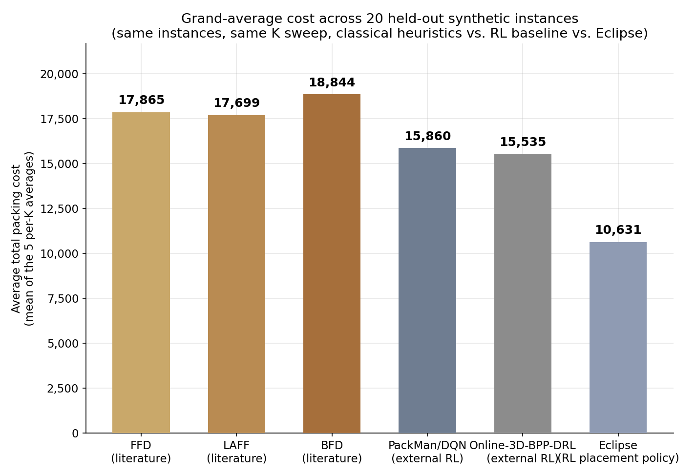

# Eclipse — Hybrid AI + Heuristic Cargo Packer

> **Want to run this on your own instance CSV?** See [`../05-run-instructions/`](../05-run-instructions/) for setup and usage — the short version is `python3 run_eclipse.py --input /path/to/your_instance.csv`.

A hybrid system for packing air cargo (Priority and Economy packages) into
ULDs (Unit Load Devices), combining trained neural network components with
heuristic local search. This folder headlines **Eclipse**, the trained RL
3D placement policy — one of three models evaluated side-by-side in this
project (see `results/three_model_k_sweep.json` and the sibling
`03-halley/` and `01-cherry/` folders for the other two).

Eclipse is a density-fine-tuned reinforcement-learning placement policy:
given a container's current state and a package to place, it picks where
to put it. It competes inside a 5-way best-of-N ensemble against four
heuristic strategies for every single container.

**Final result (this pipeline, no further AI refinement on top): total
cost 28,452** (`results/final_metrics.json`). Zero Priority packages
dropped. `01-cherry/` shows what one further AI-guided refinement pass adds
on top of this exact pipeline (28,452 → 28,409); this folder documents
the pipeline Eclipse is actually part of, on its own.

## Full pipeline — input to final cost



1. **Input**: packages + ULDs + K (delay-cost multiplier) parsed from CSV.
2. **Priority-to-ULD assignment**: a trained Transformer (`priority_clusterer.pt`,
   RL-fine-tuned) decides which ULDs hold Priority cargo and how Priority
   packages are distributed among them.
3. **Priority packing**: exhaustive heuristic placement, guaranteed —
   Priority is a hard constraint, verified 0 dropped on every run.
4. **Economy package search**: local search over Economy package
   ordering/assignment (value-density heuristic seed + swap/relocate/
   block-shuffle moves, all real-evaluated).
5. **Hybrid 3D packer — where Eclipse lives**: for every container, 5
   candidates compete on a strict best-of-N basis: **Eclipse** (the
   trained RL placement policy) plus 4 heuristic strategies (contact-area
   and deepest-corner, each with 2 candidate-generation methods). Whichever
   packs that specific container best wins it — no threshold, so adding
   Eclipse to the ensemble can only help or tie, never hurt.
6. **Final packing solution.**

## Eclipse's measured contribution

Measured directly by ablation: remove Eclipse from the 5-way ensemble and
re-run the identical pipeline on the real benchmark instance. **Cost gets
339 points worse.** That's Eclipse's real, isolated contribution — not an
assumption, a controlled before/after measurement.

## How Eclipse generalizes — 3-model comparison across all 5 K values



Eclipse's pipeline (labeled "baseline" in the shared comparison — Eclipse
is *part of* every pipeline tested, including Halley's and Cherry's, since
it's inside the shared 3D packer ensemble) was packed to completion on 20
held-out `good_data/synthetic_test` instances (4 per K, across K = 100,
500, 1000, 3000, 5000):

| K | Eclipse (this pipeline) | Halley | Cherry |
|---|---|---|---|
| 100 | 9,000.5 | 8,321.3 | **7,590.3** |
| 500 | 8,518.0 | 9,060.0 | **7,330.0** |
| 1,000 | 9,080.5 | 8,578.8 | **8,062.3** |
| 3,000 | 11,085.3 | 11,334.0 | **10,058.0** |
| 5,000 | 15,471.5 | 15,405.8 | **14,453.5** |
| **Grand average** | **10,631** | 10,540 | **9,499** |

Zero Priority packages dropped across all 60 runs. Eclipse's own
grand-average (10,631) sits close to Halley's (10,540) — Halley's
economy-ordering swap is a coin flip that roughly cancels out on average
— while Cherry's additional refinement pass on top of this same pipeline
is a clear, consistent improvement (9,499, winning 20/20 individual
instances). See `01-cherry/README.md` for that refinement's full story.

## Why reinforcement learning on the *selection* side did not work
(context, not Eclipse's own story)

Eclipse is a placement policy and is proven to help (+339 points,
measured). It's worth being precise that this is a *different* model from
the RL/GRPO approaches that were tried for package *selection/ordering*
and did **not** work (30,608–30,672, worse than a hand-tuned formula at
30,475) — see `03-halley/README.md` for that full negative-result writeup,
since Halley is exactly that model, generalized across many instances.

## Repository layout

```
02-eclipse/
├── README.md
├── src/
│   ├── model_core/         -- Priority Clusterer (trained network) + shared config
│   ├── packer/              -- Hybrid 3D packer: Eclipse (RL placement policy),
│   │                           heuristic strategies, improved candidate generation
│   ├── search/               -- Local search over Economy package ordering/assignment
│   └── model/                -- SwapProposer (tested here too, did not prove out)
├── checkpoints/
│   ├── priority_clusterer.pt      -- Priority-to-ULD assignment network
│   ├── rl_placement_policy.pt     -- Eclipse: 3D placement network (339pt proven contribution)
│   ├── swap_proposer.pt           -- pairwise ranking network (trained, not proven to help)
│   └── swap_proposer_history.json -- full per-epoch training history (real data)
├── results/
│   ├── final_metrics.json           -- cost breakdown of this pipeline's solution
│   ├── final_assignment.json        -- package -> ULD assignment
│   ├── final_placements.json        -- full 3D placement coordinates
│   └── three_model_k_sweep.json     -- raw 20-instance x 3-pipeline comparison data
├── graphs/                  -- generate_graphs.py + rendered comparison charts
└── flowcharts/               -- generate_flowcharts.py + rendered architecture diagrams
```

## Final result breakdown

From `results/final_metrics.json`:

| Metric | Value |
|---|---|
| Total cost | 28,452 |
| Delay cost (unplaced Economy packages) | 13,452 |
| Spread cost | 15,000 |
| Priority ULDs used | 3 |
| Priority packages placed | 103 / 103 (100%) |
| Economy packages placed | 151 / 297 |
| Total packages placed | 254 / 400 |

This is Eclipse's own pipeline result — no further AI-guided refinement
applied on top (that's Cherry's contribution, documented in `01-cherry/`).
