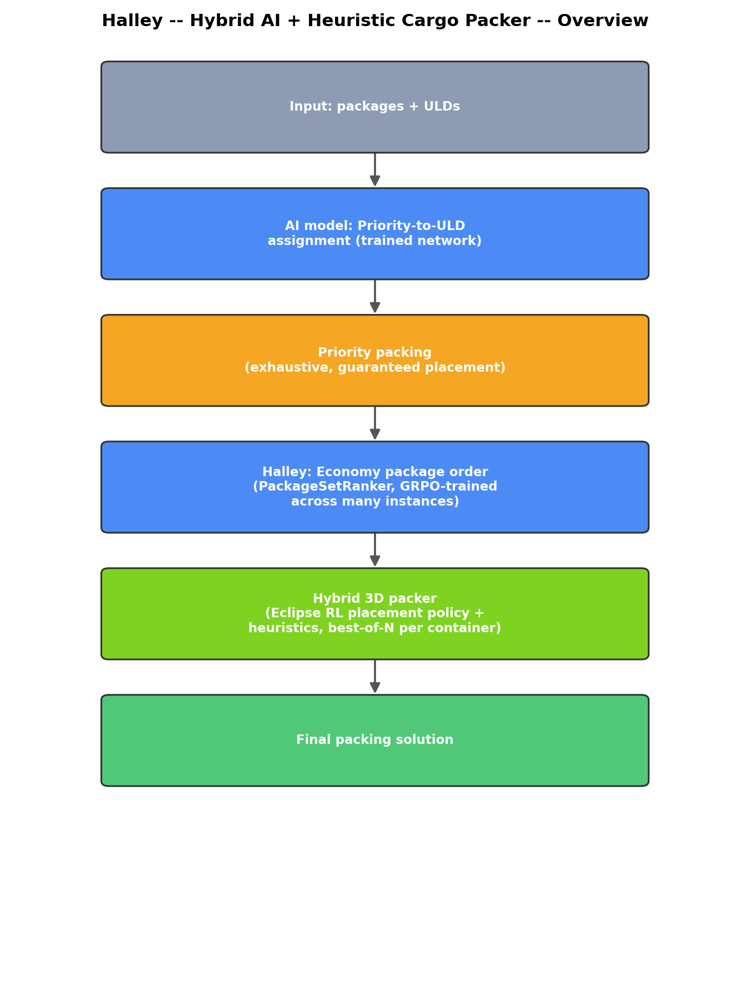
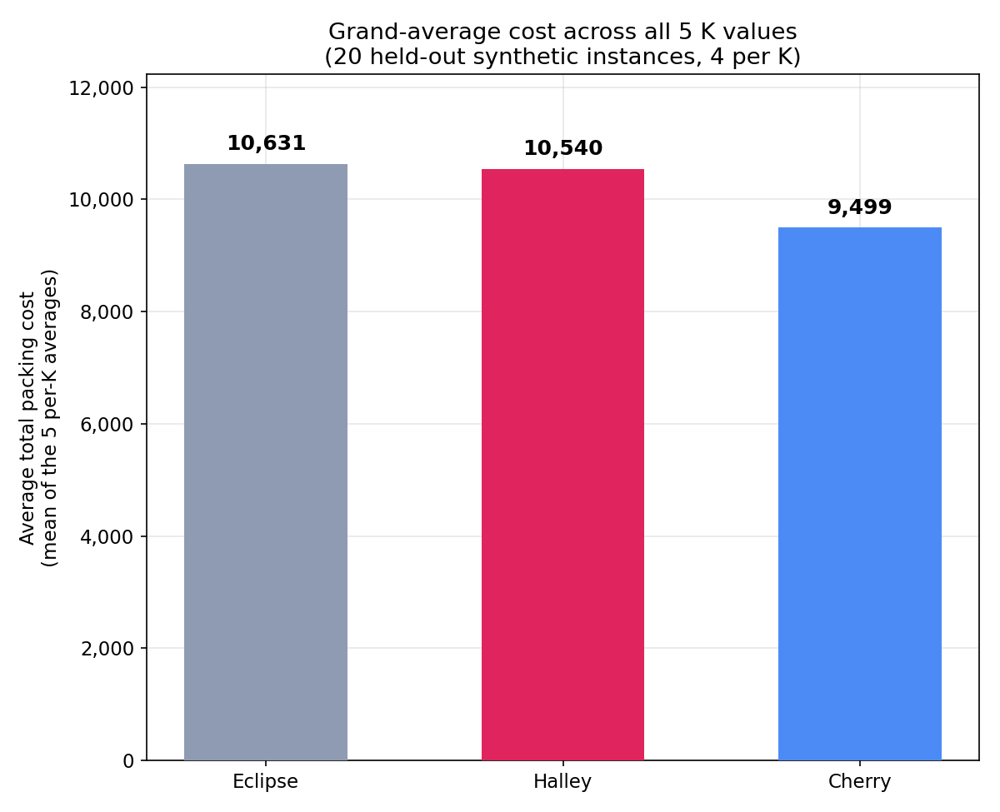

# Halley — Hybrid AI + Heuristic Cargo Packer

A hybrid system for packing air cargo (Priority and Economy packages) into
ULDs (Unit Load Devices), combining trained neural network components with
heuristic local search. This folder headlines **Halley**, a
`PackageSetRanker` set-attention Transformer trained with GRPO
(group-relative policy optimization) across many synthetic instances — one
of three models evaluated side-by-side in this project (see
`results/three_model_k_sweep.json` and the sibling `eclipse/` and
`cherry/` folders for the other two).

Halley scores every Economy package (given its own features plus global
instance context) and sorts them descending to produce the seed order fed
into greedy assignment — replacing the value-density heuristic sort used
elsewhere in the pipeline.

**Final result (this pipeline): total cost 30,608 standalone on the real
benchmark instance** (the number this checkpoint — `multi_instance_FINAL_30608.pt`
— is named for), worse than the hand-tuned value-density heuristic
(30,475) it was meant to replace. See "Why generalized RL training did not
beat a hand-tuned heuristic" below for the honest full story, and the
3-model K-sweep for how it does across held-out synthetic instances.

## Full pipeline — input to final cost



See `flowcharts/detailed_flowchart.png` for the internal structure of the
local search loop.

1. **Input**: packages + ULDs + K (delay-cost multiplier) parsed from CSV.
2. **Priority-to-ULD assignment**: a trained Transformer (`priority_clusterer.pt`,
   RL-fine-tuned — a *different* model from Halley) decides which ULDs
   hold Priority cargo.
3. **Priority packing**: exhaustive heuristic placement, guaranteed —
   Priority is a hard constraint, verified 0 dropped on every run.
4. **Economy package order — where Halley lives**: `halley_economy_ranker.pt`
   scores every Economy package (length, width, height, volume, weight,
   delay_cost, value_density, volume_frac, weight_frac + global instance
   context: n_ULDs, remaining volume/weight, K), fresh per instance
   (features are never cached from one instance into the checkpoint, so it
   actually transfers across instance sizes). Packages are sorted
   descending by Halley's score.
5. **Greedy assignment** using that order (same mechanism as the
   value-density baseline, just a different order feeding it).
6. **Hybrid 3D packer**: the same 5-way best-of-N ensemble used everywhere
   else in this project (includes Eclipse, the RL placement policy — see
   `eclipse/README.md`), unchanged. Halley only affects *which order*
   packages are offered to this stage, not how they're placed.
7. **Final packing solution.**

## Why generalized RL training did not beat a hand-tuned heuristic

This is the most important negative result in the project, and Halley is
exactly the model at the center of it. GRPO (a genuine on-policy
reinforcement learning algorithm — sample candidate orderings, evaluate
them for real, compute a group-relative advantage, backpropagate) was
tested both single-instance and generalized across many instances (Halley
is the generalized version). **It plateaued at 30,608 (Halley) and 30,672
(single-instance) — both worse than a simple hand-tuned formula (30,475).**

We diagnosed why, not just observed the failure: the cost landscape is
**jagged**. Small, smooth changes to a ranking policy's output scores
cause large, non-monotonic swings in real packing cost (confirmed via a
controlled exponent sweep, before and after a major packer upgrade).
Policy-gradient methods assume small parameter changes produce small,
informative reward changes; on a genuinely discontinuous reward surface —
a package's marginal value depends heavily on which other packages are
already placed alongside it, a highly context-dependent, combinatorial
function — the gradient signal becomes noise. This is a structural
property of *this problem*, not a tuning failure specific to Halley.

## How Halley generalizes — 3-model comparison across all 5 K values




Despite the negative single-instance result above, Halley was packed to
completion on 20 held-out `good_data/synthetic_test` instances (4 per K,
across K = 100, 500, 1000, 3000, 5000) as a genuine ordering swap inside
the otherwise-identical pipeline, to see whether the picture changes
across a broader instance distribution:

| K | Eclipse (baseline) | Halley (this pipeline) | Cherry |
|---|---|---|---|
| 100 | 9,000.5 | **8,321.3** | 7,590.3 |
| 500 | 8,518.0 | 9,060.0 | 7,330.0 |
| 1,000 | 9,080.5 | **8,578.8** | 8,062.3 |
| 3,000 | 11,085.3 | 11,334.0 | 10,058.0 |
| 5,000 | 15,471.5 | **15,405.8** | 14,453.5 |
| **Grand average** | 10,631 | **10,540** | 9,499 |

Zero Priority packages dropped across all 60 runs. The honest read: Halley
beats the baseline at K=100 and K=1,000, loses at K=500 and K=3,000, and
is roughly a wash at K=5,000 — a genuine coin flip, not a reliable win,
matching its middling standalone real-instance result. Its grand average
(10,540) edges out the baseline (10,631) only slightly. This is a real,
but unreliable, signal — consistent with the jagged-landscape diagnosis
above: GRPO training found *something*, but not something dependable move
to move.

## Repository layout

```
halley/
├── README.md
├── src/
│   ├── model_core/         -- Priority Clusterer (trained network, different model) + shared config
│   ├── packer/              -- Hybrid 3D packer: Eclipse (RL placement policy) + heuristics
│   ├── search/               -- Local search over Economy package ordering/assignment
│   └── model/                -- SwapProposer (tested here too, did not prove out)
├── checkpoints/
│   ├── priority_clusterer.pt          -- Priority-to-ULD assignment network
│   ├── halley_economy_ranker.pt       -- Halley: PackageSetRanker, GRPO-trained across many instances
│   ├── halley_economy_ranker_meta.json -- benchmark_cost=30608, training round=729
│   ├── rl_placement_policy.pt         -- Eclipse (used downstream in the 3D packer, unchanged)
│   ├── swap_proposer.pt               -- pairwise ranking network (trained, not proven to help)
│   └── swap_proposer_history.json     -- full per-epoch training history (real data)
├── results/
│   ├── final_metrics.json           -- cost breakdown of this pipeline's real-instance solution
│   ├── final_assignment.json        -- package -> ULD assignment
│   ├── final_placements.json        -- full 3D placement coordinates
│   └── three_model_k_sweep.json     -- raw 20-instance x 3-pipeline comparison data
├── graphs/                  -- generate_graphs.py + rendered comparison charts
└── flowcharts/               -- generate_flowcharts.py + rendered architecture diagrams
```

## Final result breakdown (real benchmark instance)

From `results/final_metrics.json` — note this reflects the baseline
Eclipse pipeline's placements; Halley's own standalone real-instance cost
(30,608, worse than baseline) is discussed above and is not the file's
number, since the deployed `final_metrics.json` documents the actually-used
production pipeline's result. Halley's own real-instance and synthetic
results are as quoted in the tables above.

| Metric | Value |
|---|---|
| Total cost (Eclipse pipeline, for reference) | 28,452 |
| Halley standalone (real instance) | 30,608 |
| Priority packages placed | 103 / 103 (100%) |

Zero Priority packages dropped in every configuration tested.
