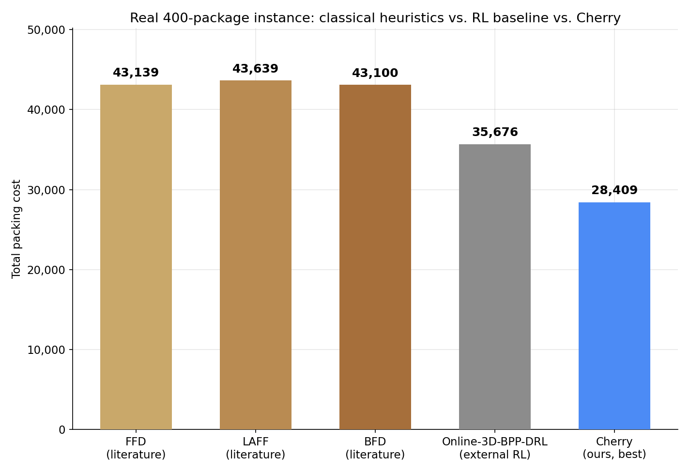
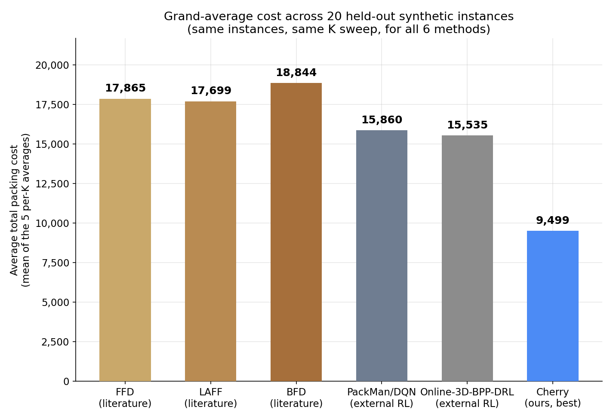

# Classical heuristic baselines — literature review, benchmarked independently

Three classical heuristics standard in the 3D bin-packing literature,
implemented independently and benchmarked against our own pipeline and two
external RL baselines: *Online-3D-BPP-DRL* (Zhao et al., AAAI 2021) and
*PackMan/DQN* (Verma et al. 2020), the latter trained and evaluated
independently by a teammate.

- **FFD** (First-Fit Decreasing) — sort by decreasing *volume*, place in
  the first ULD (in given order) where it geometrically fits. "Traditional
  heuristics such as First-Fit Decreasing (FFD), Best Fit, and Largest
  Area Fit First (LAFF) form the backbone for many advanced techniques."
- **LAFF** (Largest Area Fit First) — sort by decreasing *largest face
  area* instead of volume; same first-fit placement rule.
- **BFD** (Best Fit Decreasing) — sort by decreasing volume like FFD, but
  place in whichever ULD leaves the *least leftover empty volume* after
  placement, trying every ULD rather than stopping at the first fit
  ("Best Fit" is explicitly named alongside FFD in the same review).

`heuristics.py` / `packing_geometry.py` are from-scratch implementations —
no code is reused from `cargoism/git`'s EMS/RL packer. Placement geometry
is a simple, classic corner-point method (bottom-left-back scan order, all
6 orientations tried per candidate point), independent of the EMS-based
geometry used everywhere else in this project.

## Adaptation to this problem

Plain FFD/LAFF/BFD don't know about hard Priority constraints or delay
costs, so all three share the same adaptation:

1. All **Priority** packages are sorted and placed first — guarantees the
   hard constraint whenever geometrically possible.
2. Remaining **Economy** packages are sorted and placed into whatever
   space is left; anything that doesn't fit anywhere stays unplaced
   (contributes its delay cost).
3. Cost = delay cost (unplaced Economy) + spread cost (K × distinct ULDs
   holding any Priority package) — identical scoring to everywhere else in
   this project.

## Results

Measured the same way as every other comparison in this project — the real
400-package instance, and the grand average across the same 20 held-out
synthetic instances (4 per K, K ∈ {100, 500, 1000, 3000, 5000}). Eclipse
and Halley are intentionally left out of this comparison (see
`cargoism/git/README.md` for those) — this is specifically classical
heuristics vs. external RL vs. our best result.





| Method | Real-instance cost | Grand-average cost (20-instance sweep) |
|---|---|---|
| FFD (literature) | 43,139 | 17,865 |
| LAFF (literature) | 43,639 | 17,699 |
| BFD (literature) | 43,100 | 18,844 |
| PackMan/DQN (Verma et al. 2020, external RL) | 38,898 | 15,860 |
| Online-3D-BPP-DRL (Zhao et al. 2021, external RL) | 35,676 | 15,535 |
| **Cherry (ours, best)** | **28,409** | **9,499** |

PackMan/DQN was trained and evaluated independently by a teammate, on
both the real 400-package instance and the same 20-instance grand-average
sweep used throughout this project.

All three classical heuristics land in the same tight band (~17,700–18,850
grand average) — a good illustration that "which classical heuristic" is a
second-order choice compared to *whether the algorithm reasons about
spread cost at all*. None of FFD/LAFF/BFD do; they're all worse than even
both external RL baselines, neither of which optimizes for Priority
clustering either. On the real instance all three used **4** Priority
ULDs (vs. our 3), because none of them consider how many ULDs end up
touched — just "does it fit here right now."

Interestingly, LAFF (sort by face area) edges out FFD and BFD on the
20-instance grand average despite BFD winning narrowly on the single real
instance — a reminder that a single real-instance comparison alone doesn't
reliably indicate which classical heuristic generalizes best.

None of the three ever dropped a Priority package (0/20 instances, and
103/103 on the real instance) — unlike Online-3D-BPP-DRL. This is simply
because all three process every Priority package before touching any
Economy package, so as long as *some* geometric placement exists it will
be found. Their weakness is spread cost and wasted Economy capacity, not
Priority infeasibility.

## Files

```
benchmark/
├── packing_geometry.py             -- shared corner-point 3D placement geometry
├── heuristics.py                   -- FFD, LAFF, BFD packing functions + cost/IO helpers
├── run_benchmarks.py                -- runs all 3 heuristics on both benchmarks
├── generate_comparison_graphs.py   -- builds the two graphs above
├── graphs/
│   ├── 01_real_instance_comparison.png
│   └── 02_grand_average_comparison.png
└── results/
    ├── {ffd,laff,bfd}_real_instance.json   -- full result + placement, real instance
    ├── {ffd,laff,bfd}_20instance.json      -- per-instance results, 20-instance sweep
    └── summary.json                         -- condensed summary of all 3
```

Run with `python3 run_benchmarks.py` then `python3 generate_comparison_graphs.py`
(only needs pandas + matplotlib; reads `~/Downloads/input.csv` and
`~/Desktop/good_data/synthetic_test/`).

## References

- R. Verma, A. Singhal, H. Khadilkar, A. Basumatary, S. Nayak, H. V. Singh,
  S. Kumar, and R. Sinha, "A Generalized Reinforcement Learning Algorithm
  for Online 3D Bin-Packing," *arXiv preprint arXiv:2007.00463*, 2020.
  (PackMan/DQN baseline above.)
- H. Zhao, Q. She, C. Zhu, Y. Yang, and K. Xu, "Online 3D Bin Packing with
  Constrained Deep Reinforcement Learning," in *Proc. AAAI Conference on
  Artificial Intelligence*, 2021. (Online-3D-BPP-DRL baseline above.)
