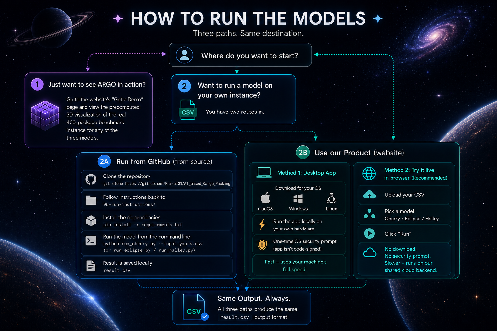
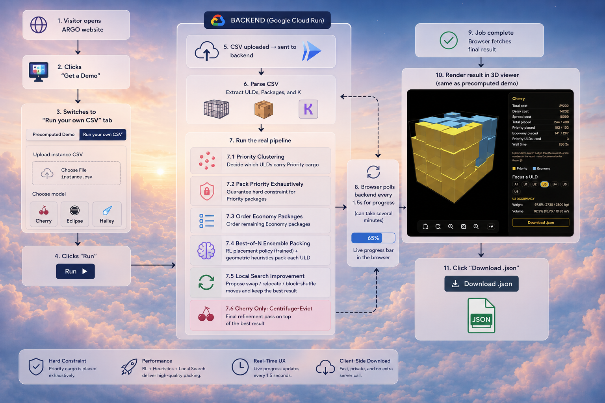

# ARGO -- the showdown

**Live site:** [ram-ui31.github.io/AI_based_Cargo_Packing](https://ram-ui31.github.io/AI_based_Cargo_Packing/)

Browse what each of the 3 ARGO models (Cherry, Eclipse, Halley) is, watch a
precomputed 3D packing of the real 400-package benchmark instance, or get
the app to pack your own instance for real.

Three ways to actually use ARGO:

1. **The live site** — landing page, model write-ups, a precomputed "Get a
   demo" 3D viewer, *and* a "Run your own CSV" mode that packs a real
   uploaded instance live, right in the browser — no download, nothing to
   approve. This is the recommended path for anyone (e.g. a judge) who'd
   rather not deal with the desktop app's code-signing security prompt.
   The frontend itself is still fully static; the live-pack call goes to a
   backend deployed on Google Cloud Run — see "The live-pack backend"
   below.
2. **The desktop app** — download it from the site's "Use our product" page
   (or straight from this repo's [Releases](../../releases)), and it runs
   the real models on your own computer, at your own computer's speed. No
   install, no Python, but the binary isn't code-signed, so the OS will
   show a one-time security warning.
3. **From source** — clone the repo and run the models directly via the
   commands in [`../05-run-instructions/README.md`](../05-run-instructions/README.md),
   for anyone who'd rather not use a browser or download an app at all.



Path 1's live-pack option and path 2 both run the exact same model code;
path 1 is slower (a shared cloud CPU vs. your own hardware — a ~400-package
instance takes on the order of 10-15 minutes live vs. a few minutes on the
desktop app) but needs nothing installed and no security prompt.

## Run it locally (full dev version, with the live backend)

```bash
cd 06-app
pip install -r requirements.txt
python3 backend/app.py
```

Then open **http://localhost:8000**. This is the same server the desktop
app freezes — useful for local development/testing of the live-pack path,
but not what the deployed website runs (see below).

(If you're running this from inside the full `cargoism/git` checkout, the
app actually prefers the live `01-cherry`/`02-eclipse`/`03-halley` folders
next to `06-app` over its own `models/` copies.)

## Deploying the live site (GitHub Pages, free, static)

The `frontend/` folder is fully self-contained and static — no backend
needed to serve the site itself. `.github/workflows/deploy-pages.yml`
auto-deploys it on every push to `main` that touches `06-app/frontend/`.

One-time setup: repo **Settings → Pages → Source → GitHub Actions**. After
that it's automatic — push a change, the workflow runs, the site updates.

The "Run your own CSV" upload mode is the one part of the page that isn't
static — it calls a live backend (see below) via `window.ARGO_API_BASE`,
set in `frontend/index.html`'s `<head>`, and only overridden when the page
is actually served from `github.io` (so the desktop app's own bundled
backend is never redirected out to the internet — see the comment next to
it in `frontend/index.html`).

## The live-pack backend (Cloud Run)



`Dockerfile` + `backend/app.py`'s `/api/pack` + `/api/status/{job_id}`
endpoints are what the site's "Run your own CSV" mode actually calls. This
is deployed on Google Cloud Run (CPU-only, `--no-cpu-throttling` so the
background packing thread isn't starved of CPU between progress polls, and
`--max-instances=1` since job state is tracked in memory and would break
if a second instance ever received a status poll for a job the first
instance created):

```bash
cd 06-app
gcloud run deploy argo-backend \
  --source . \
  --region us-central1 \
  --allow-unauthenticated \
  --memory 2Gi --cpu 2 \
  --no-cpu-throttling \
  --timeout 600 \
  --set-env-vars TORCH_NUM_THREADS=2 \
  --max-instances=1
```

If `gcloud run deploy --source` fails with a storage-permission error on a
brand-new project, the default Cloud Build service account needs
`roles/storage.objectViewer` granted once (`gcloud projects
add-iam-policy-binding <project> --member=serviceAccount:<project-number>-compute@developer.gserviceaccount.com --role=roles/storage.objectViewer`).
If the *build* itself fails with no useful log (a known rough edge with
`--source` builds), build and push the image directly instead —
`docker buildx build --platform linux/amd64 -t <artifact-registry-image> --push .`
then `gcloud run deploy argo-backend --image=<that image> ...` with the
same flags above.

This runs on a genuinely free tier (no charge expected for a hackathon
judging window's worth of traffic), but is meaningfully slower than the
desktop app or running from source — a real single-core-speed difference
between Cloud Run's shared CPU and typical local hardware, not something
more vCPUs fixes (tried 4 vCPU, no improvement, reverted to 2 to conserve
free-tier quota). Update `frontend/index.html`'s `ARGO_API_BASE` if you
redeploy to a different URL.

## What each part of the site does

- **About our models** — a short write-up of Cherry, Eclipse and Halley's
  actual architectures (what's shared, what each one adds).
- **Get a demo** — two modes, switched with the tabs at the top:
  - *Sample instance*: a precomputed 3D visualization of all 6 ULDs from the
    real 400-package benchmark instance, one result per model (switch with
    the dropdown). Generated once via `backend/demo_data/precompute_demo.py`,
    fetched by the frontend as plain static JSON from `frontend/demo_data/`.
  - *Run your own CSV*: upload any competition-format instance CSV and it's
    packed live via the Cloud Run backend (see above), with a real
    progress bar (polling `/api/status`) and the same 3D viewer rendering
    the real result when done. The expected CSV format is documented
    inline in a collapsible section on the upload panel itself.
- **Use our product** — download links for the desktop app (macOS/Windows/
  Linux, auto-highlighting your platform), a callout pointing at the live
  "Run your own CSV" option for anyone who'd rather skip the download and
  security prompt entirely, plus a fallback link to run the models from
  source instead.

## Notes on the demo numbers

Both the precomputed "Sample instance" demo and the live "Run your own
CSV" path use a lighter local-search budget (`--search-rounds 10`) than the
multi-hour research-grade search behind the numbers in the competition
report, so they won't exactly match those — they're still real, valid,
zero-overlap packings from the real models, just computed under a
demo-friendly time budget. The relative ordering (Cherry < Eclipse < Halley
on total cost) matches the report.

## Project layout

```
06-app/
├── Dockerfile                 CPU-only container build -- deployed on Cloud Run, see above
├── requirements.txt
├── backend/
│   ├── app.py                 FastAPI server (static frontend + live pack API)
│   └── demo_data/
│       ├── precompute_demo.py    regenerates the demo results (writes into
│       │                          ../../frontend/demo_data/, see below)
│       └── demo_instance.csv     the real 400-package benchmark instance
├── models/                     self-contained copies used when 01-cherry/
│   ├── 01-cherry/, 02-eclipse/, 03-halley/     etc. aren't available next
│   ├── rl_packer/                              to 06-app (e.g. the desktop
│   └── economy-package-ranker/                 app build) -- see app.py's
│                                                _resolve_model_folder()
├── desktop/                   PyInstaller launcher + build script -- see
│                               desktop/README.md
└── frontend/                  the entire live site -- fully static, this is
    ├── index.html, style.css, app.js, viewer.js (Three.js packing renderer)   what GitHub Pages deploys
    ├── vendor/           three.min.js + OrbitControls.js (vendored, offline)
    ├── assets/           background imagery
    └── demo_data/        precomputed results, fetched directly as static JSON
        ├── ulds.json, packages.json
        └── {cherry,eclipse,halley}/final_metrics.json, final_placements.json
```
