# gnn_economy_selector

A neural ranking model for the Economy package selection problem, built after
an exhaustive set of ~15 classical approaches (value-density exponent tuning,
weight-based and joint weight/volume density, ULD-ordering strategies, a
multi-knapsack ILP, new packing heuristics, two genetic-algorithm variants,
and a full sweep of Priority-ULD allocations) all failed to beat 30,475
(cost) on a real 400-package/6-ULD instance (`~/Downloads/input.csv`).

This README documents the full research arc that led to the final
`cherry`/`eclipse`/`halley` pipelines (see the repository root README for
current, grand-averaged results), including two dead ends that were
informative enough to keep: RL/GRPO's structural ceiling, and why a
"smarter" model-guided search variant needed two real fixes before it
stopped being actively counterproductive.

## The whole story, in order

```mermaid
flowchart TD
    A["Classical formulas\n(value_density^pow)\n30,475"] --> B["RL / GRPO\n(single-instance + multi-instance)\n30,608 - 30,672\n-- plateaus: gradient-based search\naround ONE local optimum"]
    B --> C{"Why only a few\nhundred points of gain?"}
    C --> D["Diagnosis: RL only REORDERS packages\ninto the same greedy_first_fit + real packer.\nThe cost landscape is empirically JAGGED\n(tiny ranking changes -> large non-monotonic swings)\n-- a smooth optimizer fighting a discrete problem."]
    D --> E["Beam search directly on the ORDER,\nreal packer as the only evaluator\n(no gradient, no proxy)\n30,475 -> 29,656 BREAKTHROUGH"]
    E --> F["SwapProposer v1: regress raw swap delta\nval_dir_acc=0.984 -- but 82% of swaps are\ncost-worsening, so that's a base-rate artifact,\nnot real skill. Guided search UNDERPERFORMED vanilla."]
    F --> G["SwapProposer v2: pairwise RANKING loss\non same-parent candidates instead\nval_rank_acc~0.85 vs 0.5 chance -- REAL signal\nGuided search: 29,656 -> 29,564"]
    G --> H{"Beam collapsed to 3 IDENTICAL\norderings -- 'beam' search silently\nbecame 3x redundant single-point search"}
    H --> I["Fix: de-dupe beam by distinct order.\nAdd block_shuffle escape move.\nStill plateaus at 29,564 -- genuine\nlocal optimum, not an artifact this time."]
    I --> J["Insight: order is a LOSSY, indirect encoding\nof what actually matters -- which packages get\nplaced, and where. Proven by the beam's own log:\n3 DIFFERENT orders -> IDENTICAL real cost."]
    J --> K["Knapsack reformulation: search the\npid -> ULD ASSIGNMENT directly\n(multiple-knapsack: maximize placed delay_cost\nsubject to per-ULD volume/weight)"]
    K --> L["v1: cheap volume+weight proxy,\nperiodic real-eval -- catastrophic:\n29,564 -> 33,000+ in 3 epochs.\nProxy is far too permissive vs real 3D fit."]
    L --> M["v2: real-evaluate EVERY candidate\nimmediately, no batching -- stable,\nmatches order-based best (29,564),\nno further improvement found"]
    M --> N["MILP ceiling analysis: solve the EXACT\nvolume+weight multiple-knapsack (scipy HiGHS)\ntheoretical floor ~25,387 -- but MILP's own\noptimal SELECTION, real-3D-packed, scores 31,540\n(worse than 29,564!)"]
    N --> O["CONCLUSION: the remaining gap is a\n3D-PACKING-EFFICIENCY problem, not a\n'which packages' search problem.\nOur real packer achieves ~78% of what pure\nvolume/weight math allows -- no amount of\nsmarter selection search can close that."]
    O --> P["MultiRestartPacker polish (free lever,\nsame selection, better 3D arrangement search):\n+18 points -- real but small, smaller than\nMPS floating-point noise between reruns (~280pts)"]
```



## Results across every method tried

| Method | Real cost | Notes |
|---|---|---|
| Classical formula (`value_density^1.5`) | 30,475 | Best of ~15 hand-tuned formulas/ILP/GA variants |
| RL / GRPO (single-instance) | 30,672 | Gradient-based local search around one starting point |
| Multi-instance GRPO (generalized) | 30,608 | Same ceiling, but generalizes across instances |
| **Beam search (order-based, real-packer-evaluated)** | **29,656** | The session's actual breakthrough |
| **Guided beam search (SwapProposer v2, ranking loss)** | **29,564** | Best result from this research phase |
| Knapsack search (direct assignment) | 29,564 | Matches order-based best; didn't exceed it |

## Why RL/GRPO only moved the needle by a few hundred points

RL/GRPO never changes *how* packages get placed — it only reorders which
Economy packages get first crack at `greedy_first_fit`. That's a real lever,
but a gradient-based policy is a **smooth optimizer**, and this cost surface
is empirically **jagged**: small, monotonic changes to a ranking formula's
exponent swing real cost by 200-800 points non-monotonically. Confirmed
repeatedly across the whole session (classical formula sweep, RL/GRPO
training curves, and the beam search's own convergence data all show the
same discontinuous character). Gradient descent is the wrong tool for a
cost landscape shaped like that; direct local search with the real packer
as the only evaluator is not fighting a smoothness mismatch, which is why it
broke through where RL/GRPO couldn't.

## The SwapProposer: a genuine before/after, not just a bigger model

The first training run looked great on paper (`val_dir_acc = 0.984`) and
made the guided search *worse* than random search in practice. The second
version fixed the actual problem and the metric dropped to a much less
impressive-looking ~0.85 — but that's the run whose guided search actually
matched the order-based best.

**What went wrong in v1**: it regressed the raw real-cost delta of a swap
with a Huber loss. But ~82% of logged swaps make things worse, ~13% are
neutral, and only ~5% actually help — so a model that just learns to predict
"probably worse" scores 98% on directional accuracy without learning
anything about what makes one swap *better than another*. The val loss
curve confirms it: it overfits after ~epoch 100 (val loss climbs back up)
while train loss keeps falling.

**The fix (v2)**: reframe as **pairwise ranking** — given two candidate
swaps tried against the *same* parent in the *same* round (so their deltas
are directly comparable), predict which one is better, trained with a
margin ranking loss. This sidesteps the class-imbalance problem entirely
(ranking doesn't care about the base rate of "improving" vs "worsening") and
directly matches what the guided search actually needs: not "is this swap
good in absolute terms" but "which of these ~48 candidates should I spend a
real evaluation on." Chance baseline for this task is 50%; v2 reached ~85%.

## Why the beam kept "improving" without actually finding anything new

At one point the log showed all 3 beam members converged to the exact same
ordering — meaning every subsequent round was perturbing 3 identical copies
of one solution, a "beam" search that had silently collapsed into 3x
redundant single-point local search. Fixed by de-duplicating the beam by
distinct order every round. After the fix, the beam correctly held 3
*genuinely different* orderings — that still shared the same real cost, so
this wasn't a bug the second time, just a real local optimum for the
available move types (swap / relocate / block-shuffle).

## The insight that mattered most: order is a lossy encoding

The beam search's own convergence data proved something the whole
order-based approach had been fighting blind: **three different orderings
converged to the identical real cost.** `greedy_first_fit` collapses a huge
space of orderings onto a much smaller space of actual assignments — order
was never the real decision variable, just an indirect, many-to-one way of
reaching one. That's why order-perturbation search plateaus: once a good
assignment is found, nearby order-perturbations mostly just re-derive it.

This motivated reformulating the problem as a direct search over the
`package -> ULD` **assignment** itself (a multiple-knapsack problem: with
spread fixed by the already-settled Priority partition, maximize placed
delay-cost subject to each ULD's remaining volume/weight). The state IS the
decision variable now, so no move is wasted re-deriving something already
tried.

**First attempt at this failed instructively**: a cheap volume+weight-only
proxy screened candidate moves before periodic real verification, and it
was catastrophically over-permissive — box shape/orientation constraints
reject plenty of "fits by volume/weight" moves, and batching ~100 such moves
before ever checking reality let the error compound (real cost went from
29,564 to over 33,000 in 3 epochs, confirmed not a temperature/tuning issue
by testing near-zero temperature too). Fixed by real-evaluating every single
candidate immediately, exactly as the order-based beam search already
reliably did. That version matched the order-based best (29,564) but didn't
exceed it.

## The MILP ceiling: proving the remaining gap is about 3D packing, not selection

To find out how much headroom is actually left, the Economy selection
problem was solved as an **exact multiple-knapsack MILP** (volume + weight
capacity only, via `scipy.optimize.milp`/HiGHS) — a valid upper bound on any
order/assignment search, since true 3D geometric packing can only be harder
than this relaxation, never easier.

The relaxation's theoretical floor is ~25,387 — well below our 29,564. But
taking the MILP's own optimal item *selection* and real-3D-packing it
scores **31,540** — worse than our result — because 177 of its "selected"
packages don't actually fit together
once real box shapes are considered. **The bottleneck isn't which packages
to select** (the real-packer-guided searches above were already solving that
about as well as it can be solved); **it's 3D packing efficiency itself.**
Our real packer only achieves ~78% of what pure volume/weight math would
allow. No amount of smarter item-selection search — order-based, knapsack,
or otherwise — can close a gap that lives in the packer's geometric
arrangement quality.

Consistent with that diagnosis: `MultiRestartPacker` (epsilon-greedy
multi-restart per ULD, already implemented, just not in the default
ensemble) was tried as a same-selection / better-3D-arrangement lever on the
current best assignment. It gained a real but modest 18 points — smaller
than the ~280-point noise floor from Apple Silicon MPS floating-point
non-determinism between identical reruns. Real, but not a lever with much
more room in it without deeper packer-algorithm work (genuinely improving
or retraining the 3D placement policy, out of scope for this session).

## Priority-to-ULD allocation: already at (or very near) optimal

A secondary question — given the fixed best 3-ULD Priority combo, does *how*
the 103 Priority packages are distributed among those 3 ULDs matter? Five
allocation strategies tested; the current default (first-fit by descending
volume) beats all four alternatives.

## Architecture

A Set-Transformer-style permutation-invariant scorer (attention over the
full candidate Economy package set, not a fixed formula) trained via GRPO,
plus the standalone `SwapProposer` (a small pairwise-ranking MLP, a
different learning target entirely — see above) used to guide the beam
search's candidate generation.

```
gnn_economy_selector/
├── src/
│   ├── model.py              -- PackageSetRanker (set-attention scorer, GRPO-trained)
│   ├── swap_proposer.py      -- SwapProposer (pairwise ranking MLP)
│   ├── train_swap_proposer.py -- trains on beam_moves_*.jsonl byproduct data
│   ├── features.py           -- shared package/global feature builders
│   ├── multi_instance_grpo.py -- GRPO training across sampled synthetic instances
│   └── ...
├── checkpoints/
│   ├── grpo_FINAL_30672.pt              -- single-instance GRPO final
│   ├── multi_instance_FINAL_30608.pt    -- multi-instance GRPO final (generalizes)
│   └── swap_proposer.pt                 -- pairwise ranking MLP, v2 (ranking loss)
├── data/                                -- training logs, sweep results
└── README.md
```

`data/centrifuge_train.jsonl` (Cherry's `CentrifugeEvictProposer` training
set, ~100MB) is excluded from version control — regenerate it locally with
`python src/generate_centrifuge_data.py`.

The actual local-search scripts (`beam_search_economy.py`,
`beam_search_guided.py`, `knapsack_search_economy.py`, `milp_ceiling.py`)
live in `../ga_cargo_packing/scripts/` — this repo's model checkpoints are
consumed from there via `sys.path.insert`, same reuse pattern used
throughout. Does not modify `~/Desktop/ga_cargo_packing/`.

## What's left

- Per the MILP analysis above, the remaining gap is primarily a **3D
  packing algorithm** problem now, not a package-selection problem. The
  next real lever is improving or retraining `rl_packer`'s placement
  policy itself, or a genuinely better geometric bin-packing heuristic —
  out of scope for local-search-over-selection work.
- `SwapProposer` was trained on only 377 rankable pairs (42 parent groups)
  — more beam-search mileage would give it more (and more diverse) data;
  worth revisiting once the packer-efficiency lever above is addressed,
  since a better proposer only matters if there's still selection-level
  headroom to find.
